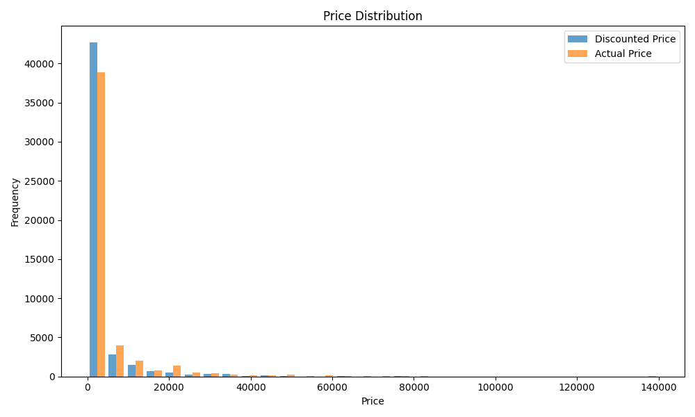

# :earth_americas: E-commerce Data Analysis for Amazon

# Project Scope 

The project scope is to gather insights about the users of Amazon, and find things like customer shopping behaviors, segment customers based on their buying patterns, and identify relationships between products. 

# Data preprocessing 

Methods used:

1. dropNA: dropped all the values
2. Feature engineering: frequency, monetary value etc.

# Visualizations:

## Price Distribution Analysis

The scatter plot above shows the relationship between actual prices and discount prices across different product categories on Amazon. Key observations:
- Electronics products show the widest price range and highest prices
- Most products cluster in the lower price ranges (0-20,000)
- There's a strong linear relationship between actual and discount prices
- Different product categories show distinct pricing patterns

# Key insights

1. People usualy buy eletronics, coumputers along twith their accessories, and kicthen appliences from amamzon
2. The avrage price of most amazon orders is between $500 to $1000
3. There is a fine limit for discounts, which is around 70%, then the quality of the prouduct w
4. Based on Clustering, i found out that mst people buy one thing per purchas, and usualy do not buy in bulk unless it is cheap.
5. Basedon rule ascoation rule mining with the apriori algrothim, i found that usualy the prices for coumputers and acsories are in tme medium range, and has an avrage rating. This means that they are not too expensive, and not too good. The home and kicthen has a high price, but a medium rating, so the items there are over priced items. The electronics items have a high pirce, but a high rating, so it says that the items are good quality and are proplery priced. 

# Steramlit deployment link 

https://gdp-dashboard-3r3a45ggkft.streamlit.app

# Refrecens

[www.youtube.com/watch?v=afPJeQuVeuY&t](https://www.youtube.com/watch?v=afPJeQuVeuY&t)
